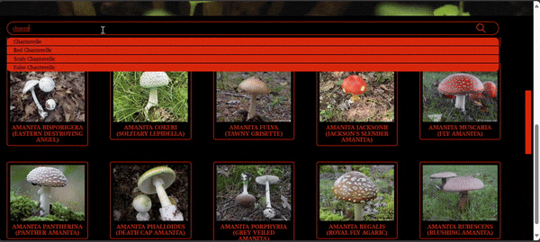
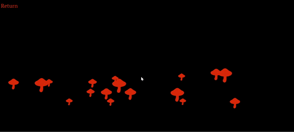

# Mushpedia Frontend
Welcome to Mushpedia, a mushroom encyclopedia website built with Next.js. It allows users to search for various mushrooms and view detailed information about them. Additionally, it features a small Matter.js game.

## Features
* Mushroom Search: Easily search for different types of mushrooms.
* Detailed Information: View detailed descriptions, images, and other relevant information about each mushroom.
* Interactive Game: A mini-game built with Matter.js for some light entertainment.

## Webiste
Check out the website [here](https://mushpedia.vercel.app/).

## Screenshots



## Technologies Used
* Next.js
* Matter.js
* Tailwind CSS
* Framer Motion
  
## Getting Started

### Prerequisites
Ensure you have the following installed on your development machine:

Node.js (v14 or higher)
npm (v6 or higher) or yarn

### Installation
Clone the repository:

```sh
git clone https://github.com/your-username/mushpedia-frontend.git
```

### Install dependencies:

```sh
npm install
```

### Run the development server:

```sh
npm run dev
```
